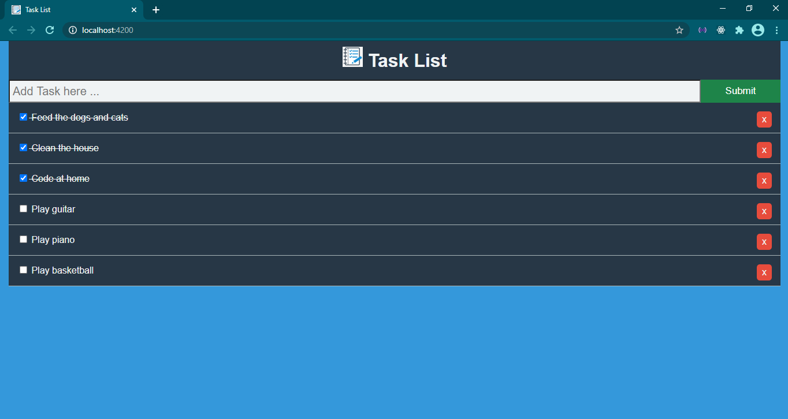

# TASK LIST IN ANGULAR

* Purpose: My Project
* Front End: HTML5, CSS3
* Used JavaScript Framework: Angular
* Responsive Web Design: Yes
* Type of Website: Dynamic

<h2> User Interface Screenshot </h2> 
  
    